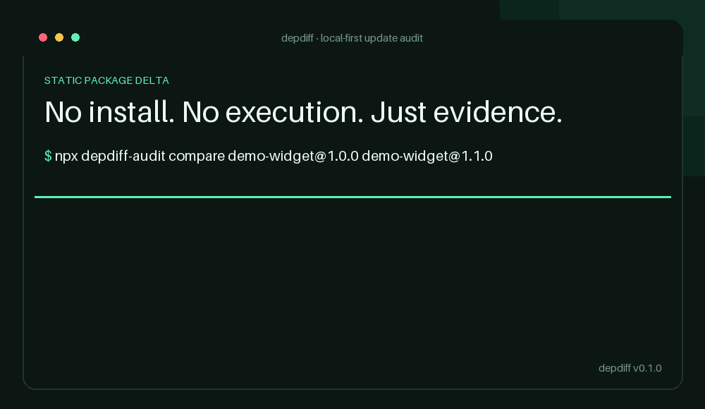
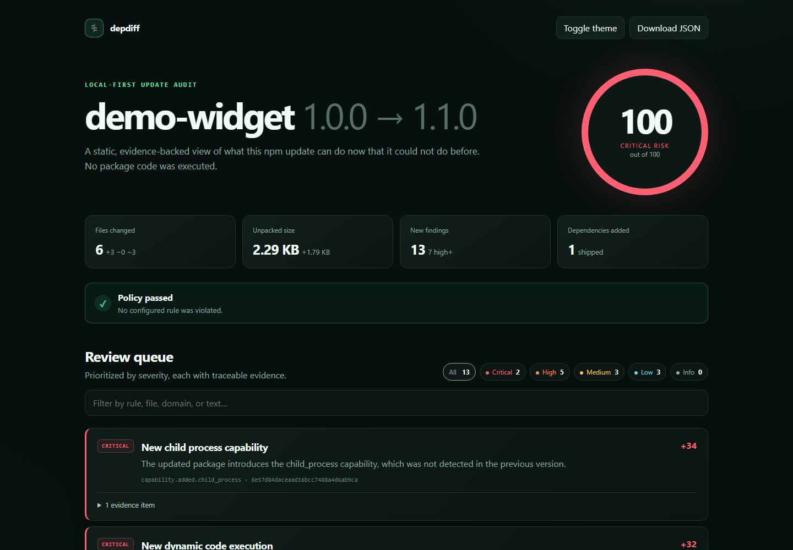
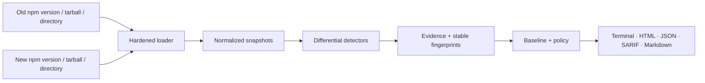

<div align="center">
  <h1>Depdiff</h1>
  <p><strong>See what an npm update can do now that it could not do before.</strong></p>
  <p>
    <a href="https://github.com/depdiff/depdiff/actions/workflows/ci.yml"></a>
    <a href="https://www.npmjs.com/package/depdiff-audit"></a>
    <a href="LICENSE"></a>
    <a href="https://nodejs.org"></a>
  </p>
</div>



Depdiff downloads—or accepts locally—the old and new npm package tarballs, performs a static differential audit, and produces a review queue with file-and-line evidence. It never runs the package, imports its modules, or invokes its lifecycle scripts.

- **Review the change, not the universe.** New network destinations, install hooks, process execution, filesystem access, binaries, dependencies, and ownership changes rise to the top.
- **Keep package code on your machine.** Analysis and reports are local; `--offline` makes network access impossible and accepts directories/tarballs only.
- **Gate updates without a black box.** Stable fingerprints, baselines, policy-as-code, CI exit codes, SARIF, JSON, Markdown, and a standalone HTML report are built in.

## Quickstart

```bash
npx depdiff-audit compare lodash@4.17.20 lodash@4.17.21
npx depdiff-audit demo --no-fail
docker compose run --rm depdiff
```

The first command writes `depdiff-report.html`. The second is a deterministic, offline fixture that deliberately adds an install script, `child_process`, a network destination, encoded code, a maintainer change, and a native-looking binary. The Docker command builds and runs that same demo, writing artifacts to `reports/`.

Compose mounts the repository read-only at `/workspace`, so local artifacts can be scanned with `docker compose run --rm depdiff compare /workspace/old.tgz /workspace/new.tgz --offline --output /reports/review.html`.



## What it catches

| Change surface | Examples of evidence |
|---|---|
| Network | New `fetch`/HTTP/socket capability, literal domains and IPs, DNS APIs |
| Execution | `child_process`, `eval`, `Function`, `vm`, dynamic module loading, WebAssembly compilation |
| Install-time behavior | Added or changed `preinstall`, `install`, `postinstall`, `prepare`, and publish hooks |
| Filesystem and payloads | New `fs` access, executable bits, native/binary files, symlinks, size spikes |
| Obfuscation | High-entropy Base64/hex blobs, entropy jumps, very dense/minified/generated payloads |
| Package graph | Added runtime/optional/peer dependencies and changed versions |
| Ownership and provenance | Maintainer set, repository/name metadata, registry integrity, signature/attestation removal |

Every finding includes a stable rule ID, fingerprint, severity, score contribution, evidence, and review guidance. A score is a prioritization aid—not a claim that a package is malicious or safe.

## Common workflows

Compare two exact registry releases:

```bash
depdiff compare @scope/package@2.4.1 @scope/package@2.5.0
```

Compare a downloaded tarball with a local directory, with no network access:

```bash
depdiff compare package-1.0.0.tgz ./candidate --offline --output review.html
```

Create and enforce a policy:

```bash
depdiff init
depdiff compare pkg@1.0.0 pkg@1.1.0 --policy .depdiff.yml --ci
```

Accept the current findings once, then surface only genuinely new ones later:

```bash
depdiff compare old.tgz new.tgz --offline --write-baseline .depdiff-baseline.json --no-fail
depdiff compare newer.tgz newest.tgz --offline --baseline .depdiff-baseline.json --policy .depdiff.yml
```

Generate every machine-readable format:

```bash
depdiff compare old.tgz new.tgz --offline \
  --output report.html --json report.json --markdown report.md --sarif report.sarif
```

See the complete [CLI reference](docs/cli.md), [policy reference](docs/policy.md), and [rule catalog](docs/rules.md).

## Policy and exit codes

```yaml
version: 1
failOn: high
maxRiskScore: 49
denyCapabilities: [child_process, dynamic-code]
denyDomains: ["*"]
allowDomains: ["registry.npmjs.org", "*.example.com"]
allowInstallScripts: false
maxAddedDependencies: 10
maxAddedFiles: 250
ignoreFindings: []
includeBaseline: false
```

| Code | Meaning |
|---:|---|
| `0` | Audit completed and policy passed (or `--no-fail`) |
| `1` | Audit completed and policy failed |
| `2` | Invalid input, policy, archive, or configuration |
| `3` | Unexpected internal failure |

## GitHub Actions

```yaml
- uses: actions/checkout@v4
- name: Audit the candidate update
  uses: depdiff/depdiff@v1
  with:
    before: package-name@1.4.0
    after: package-name@1.5.0
    policy: .depdiff.yml
```

The Action emits inline annotations and writes HTML + SARIF. A complete workflow—including Code Scanning upload and artifact retention—is in [`examples/github-action.yml`](examples/github-action.yml).

## How it works



Registry metadata is fetched only from the configured HTTPS origin. Tarball redirects are pinned to that origin, integrity/shasum is verified when supplied, archive paths and entry types are validated before extraction, and configurable limits bound compressed size, unpacked size, file count, and individual files. Extraction happens in a disposable directory. Symlinks are never followed; archive links and special devices are rejected.

JavaScript/TypeScript is parsed with Babel when possible and backed by lexical detectors for evasive/generated input. Files are compared by SHA-256 and normalized package metadata. Read the full [architecture and trust-boundary document](docs/architecture.md).

## Where Depdiff fits

The tools below solve different problems and work well together. This comparison is intentionally narrow; linked project documentation is the source of truth.

| Tool | Primary question | Version-to-version capability diff | Offline local inputs | Standalone review report |
|---|---|:---:|:---:|:---:|
| **Depdiff** | What security-relevant behavior did this update add? | **Yes** | **Yes** | **HTML, JSON, SARIF, Markdown** |
| [`npm diff`](https://docs.npmjs.com/cli/commands/npm-diff/) | Which file lines changed? | Text diff | Yes | Terminal patch |
| [`npm audit`](https://docs.npmjs.com/cli/commands/npm-audit/) | Do installed dependencies match known advisories? | No | Registry-backed | Terminal / JSON |
| [GuardDog](https://github.com/DataDog/guarddog) | Does a package match malware capabilities/threat chains? | Package scanning | Local archives/directories supported | Terminal / JSON / SARIF |
| [Socket](https://docs.socket.dev/docs/package-search) | What supply-chain, quality, maintenance, vulnerability, and license signals does a package have? | Product-specific analysis | Consult current product docs | Web product / integrations |

Depdiff's deliberately small wedge is the *semantic delta*: “this update newly gained `child_process`, contacts this new domain, and added this install hook.” It does not replace advisory scanning, sandboxed malware analysis, a source diff, or human review.

## Security posture

- Target packages are treated as hostile data and are never executed.
- Registry access is opt-out with `--offline`; no analysis data or telemetry is sent anywhere.
- HTML output escapes package-controlled content and has no external JavaScript/CSS dependency.
- Archive defaults: 128 MiB compressed, 512 MiB unpacked, 100:1 maximum compression ratio, 25,000 files, 32 MiB per file, 2 MiB parsed text.
- Heuristics have false positives and false negatives. Runtime-computed behavior, native code, and novel obfuscation require deeper review.

See [SECURITY.md](SECURITY.md) for the threat model and vulnerability reporting process.

## Development

```bash
npm ci --ignore-scripts
npm run check
npm run demo
```

Node.js 20.12+ is supported. Contributions are welcome—start with [CONTRIBUTING.md](CONTRIBUTING.md). Depdiff is MIT-licensed.
