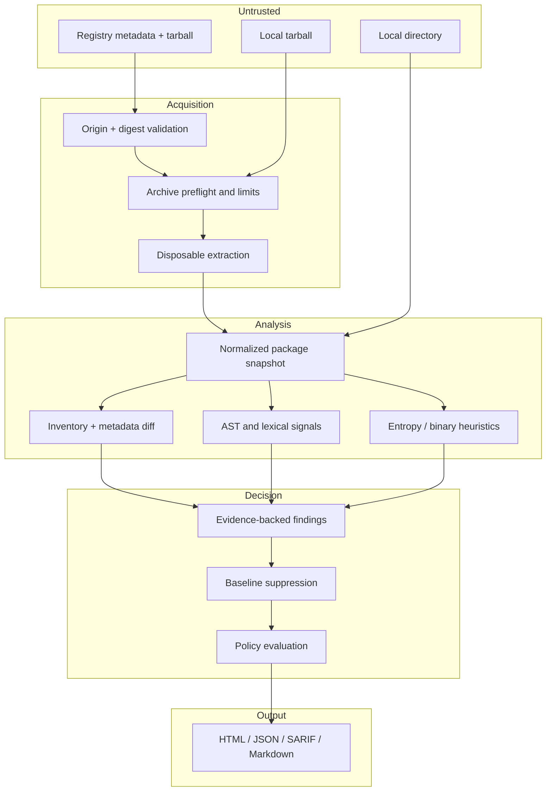

# Architecture and trust boundaries

Depdiff is a static differential analyzer. Its central invariant is simple: **the target package is untrusted data and must never become executable input to Node.js, a shell, npm, or a report renderer.**

## Data flow

## Acquisition

Registry specifiers resolve through one configured HTTPS origin. Depdiff strips credentials from the configured URL, rejects non-HTTPS registries, validates every redirect target before issuing the next request, and requires the tarball host to match. Redirect chains are limited to five hops. Registry metadata is consumed as a stream and aborted above 16 MiB. This is intentionally strict to reduce SSRF, redirect, and memory-exhaustion risk. Private registries that use a separate blob host are not supported in v0.1; download the tarball separately and scan it locally instead.

Downloaded tarballs are cached only by a verified integrity identity. When the registry supplies `dist.integrity`, Depdiff validates its syntax and verifies the strongest SHA-512/384/256 digest; an unsupported or malformed non-empty value fails closed. Otherwise it verifies `dist.shasum` when present. A tarball with no registry digest may still be reviewed with a high-severity provenance finding, but its unauthenticated bytes are deleted after analysis rather than persisted in the cache.

Archive processing uses two passes. The first validates every path, entry type, declared size, total size, count, and decompression ratio; validation failure aborts the parser immediately. Absolute paths, drive paths, `..`, symbolic/hard links, devices, FIFOs, and other special entries are rejected. The second extracts regular files/directories into a random temporary directory with path preservation disabled. npm-style archives must have one canonical `package/` root—siblings are rejected rather than silently omitted. The directory is removed in a `finally` block.

Local directories are traversed with `lstat`/`realpath` containment checks. Symlinks are fingerprinted but not followed. `.git`, `node_modules`, and Depdiff output/cache directories are ignored by default only for local working-directory inputs. Tarball/registry inputs inventory every shipped path, including bundled dependencies; only explicit `--ignore` patterns apply to archives.

## Snapshot and analysis

Each file has a relative path, size, normalized mode, explicit mode-reliability flag, kind, and SHA-256. Tar-header modes are authoritative; native Windows and Windows-backed Docker Desktop 9p bind modes are marked unknown so host synthesis cannot create false executable transitions. Only bounded files are kept in memory for content analysis. `package.json` is parsed as data with defensive normalization and fails closed above the parsed-text limit so lifecycle scripts cannot disappear from policy evaluation; target dependencies are never installed.

Source analyzers combine Babel AST parsing with conservative lexical fallbacks. They profile capability sets and literal network hosts for both versions, then report capabilities or hosts that occur only in the candidate version. Inventory, script, dependency, maintainer, registry provenance, entropy, minification, and binary detectors operate directly on the normalized delta.

Fingerprints hash the package name, rule, and semantic identity rather than timestamps, absolute source roots, or report ordering. Capability identities include hashes of the candidate files that carry the signal, so changed behavior in the same path re-enters review. Fingerprints remain deterministic for the same inputs, cannot accidentally cross-suppress another package, and power baselines.

## Decision model

Findings carry an explicit score contribution. Scores sum to a capped 0–100 queue-priority number. Baseline findings remain visible but do not contribute to current risk. Policy evaluates the remaining findings plus structural limits such as added file/dependency counts.

The score is not a probability and Depdiff does not call packages malicious. Severity communicates review urgency for a newly acquired capability.

## Output safety

JSON and SARIF are generated from plain data objects. Markdown normalizes line/control characters before escaping syntax-bearing characters; terminal summaries also strip controls. SARIF and workflow file locations are emitted only when a local-directory path resolves inside the selected workspace. Registry/tarball package paths remain in result properties without being misattributed to consumer source files. HTML escapes all package-controlled values in markup and Unicode-escapes `<`, `>`, `&`, and script-separator characters in embedded JSON. CSS and JavaScript are inline, so the report has no third-party runtime dependency and can be archived as one file.

## Known limits

- Static analysis cannot reliably resolve destinations, modules, or commands assembled at runtime.
- Babel parse failure falls back to lexical signals; it can reduce coverage.
- Native binaries are inventoried and hashed, not disassembled.
- Minified and generated code is flagged but not automatically deobfuscated.
- Package-level comparison does not recursively download or analyze newly added dependencies.
- Registry maintainer metadata may be incomplete or differ from `package.json`.
- A clean result means no configured heuristic found a new signal; it is not proof of safety.
